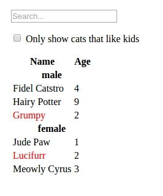
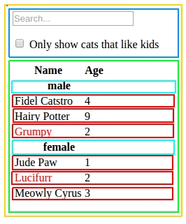

## Cat Shelter App

Gratulacje. Dostałeś swoje pierwsze zlecenie. Tworzysz aplikację dla schroniska pokazującą kotki do adopcji. Aplikacja ma pokazywać dane kotów przebywających w schronisku (płeć, wiek, imie, to czy kot lubi dzieci). Ma też umożliwiać wyszukanie kotka po imieniu, a także pokazywać które koty lubią mieszkać z małymi dziećmi. Schronisko ma przygotowaną baze danych. Po rozmowach z programistą bazy danych dowiedziałeś się że dane bazy będą przekazywane w następującym formacie:
```javascript   
[
 {category: "male", age: "4", likesKids: true, name: "Fidel Catstro"},
 {category: "male", age: "9", likesKids: true, name: "Hairy Potter"},
 {category: "male", age: "2", likesKids: false, name: "Grumpy"},
 {category: "female", age: "1", likesKids: true, name: "Jude Paw"},
 {category: "female", age: "2", likesKids: false, name: "Lucifurr"},
 {category: "female", age: "3", likesKids: true, name: "Meowly Cyrus"}
];
```
Jest to tablica obiektów. Każdy obiekt ma pola category, age, likesKids i name. Co więcej ważną informacją jest fakt że dane zawsze będą posortowane czyli najpierw będą koty płci męskiej a potem kotki.

Grafik przekazał wam również projekt wyglądu aplikacji. Widzisz że aplikacja ma kilka funkcjonalności.  


1) Wyświetla dane o kotach z podziałem na płeć (w danych zaznaczoną jako category). Ponieważ ludzie są mniej chętni do adopcji kocurów, mają one być wyświetlone najpierw.
2) Koty, które nie mogą przebywać z małymi dziećmi są zaznaczone na czerwono
3) Można filtrować koty po tym czy mogą przebywać z małymi dziećmi
4) Można wyszukiwać kota po imieniu


## Co teraz? Od czego zacząć? zbudować działającą aplikację w React?

Szukasz podpowiedzi w internecie i znajdujesz tutorial pozwalający zbudować dowolną aplikację React w 5 łatwych krokach:)

### Krok 1. Podziel aplikacje na komponenty
### Krok 2. Stwórz statyczną wersję wykorzystującą React. Zadbaj o przekazywanie danych przez props.
### Krok 3. Zastanów się jaka jest minimalna ilość zmiennych potrzebnych do stworzenia stanu aplikacji (State)
### Krok 4. Zastanów się, w których komponentach należy umieścić State.
### Krok 5. Zadbaj o przekazywanie danych od dzieci do rodzica (inverse data flow).

Brzmi interesująco, ale nie wiele Ci to wyjaśnia. Piszesz maila do kolegi z kursu frontendowego, który przesyła ci w odpowiedzi konkretny schemat postępowania dla twojej aplikacji.

## Krok 1. Podział na komponenty
Najpierw dzielimy projekt na komponenty na podstawie funkcjonalności. Korzystamy z "single responsibility principle". Czyli komponent wykonuje jedną rzecz - ale robi ją dobrze! Jak to interpretować w kontekście zagnieżdżonych komponentów? Wewnętrzny wykonuje jedną rzecz - a zewnętrzny inną korzystając z funkcjonalności wewnętrznego komponentu.
Inspiracją do identyfikacji poszczególnych funkcjonalności mogą być czasami warstwy w projekcie graficznym – dobry UI też jest stworzony z myślą o funkcjonalnościach. Niestety nasz projekt graficzny nie posiada warstw:)

W naszej aplikacji możemy wyróżnić 5 różnych komponentów.  


* App (żółty) : Zawiera całą naszą aplikację
* SearchBar (niebieski): odbiera dane od użytkownika
* CatTable (zielony): wyświetla i filtruje dane z bazy w zależności od danych użytkownika
* CategoryRow (turkusowy):  wyświetla nagłówek
* CatRow (czerwony): wyświetla dane kociaka

Nie jest to jedyne dobre rozwiązanie. Podział może być wykonany inaczej. Nie ma jedynego dobrego sposobu podziału na komponenty.

Komponenty mają swoją hierarchię:

App
  *SearchBar
  *CatTable
    **CatCategoryRow
    **CatRow

App wymaga SearchBar i CatTable a
CatTable wymaga CatCategoryRow i CatRow

Dlaczego CatRow i CatCategoryRow nie zostały podzielone na mniejsze komponenty? Składają się tylko I wyłącznie z prostych elementów html, nie ma też potrzeby aby komponenty te miały jakikolwiek stan.

## Krok 2. Statyczna wersja strony
Wersja statyczna czyli co?
* Wiemy jak wyglądają dane, które docelowo dostaniemy z serwera
* Korzystając z tego i podziału na komponenty tworzymy sam interfejs użytkownika.
* Zajmujemy się TYLKO wyświetlaniem danych – nic nie jest klikalne!


Tworzymy komponenty, które :
* Implementują tylko metodę render()
* Wykorzystują inne komponenty
* Otrzymują I przekazują dane korzystając z props – na tym etapie nie implementujemy State. State jest nam potrzebny tylko po to, aby komponent był interaktywny czyli nie teraz:)

Tworząc aplikację możemy korzystać z podejścia “top-down” czyli zacząć od najbardziej ogólnego komponentu (u nas  App) lub bottom-up czyli od najbardziej podstawowych przykładowo (CatRow)
Małe projekty łatwiej jest tworzyć korzystając z podejścia top-down. W ten sposób łatwo możemy zrozumieć przekazywanie props w aplikacji.


Skoro mamy już komponenty to teraz warto się zastanowić..
**Czego potrzebują nasze komponenty aby się poprawnie wyświetlać?**

Aby odpowiedzieć na to pytanie patrzymy  na przykładowe dane i na layout aplikacji.
Przyjmujemy założenie że dane są przekazywane do głównego komponentu aplikacji czyli do App.
Dane są tablica obiektów, dla przykładu będziemy analizować sytuację dla pojedynczego obiektu.

var kitty = {category: "male", age: "9", likesKids: true, name: "Hairy Potter"}

* CatCategoryRow (turkusowy) pokazuje: kitty.category
* CatRow (czerwony) pokazuje : kitty.name, kitty.cena
jego tekst jest czarny jeśli kociak lubi dzieci lub czerwony jeśli tak nie jest – potrzebujemy więc także
kitty.likesKids aby komponent wyświetlał się prawidłowo.
* CatTable – renderuje CatCategoryRow I CatRow, mimo że komponent sam nie operuje na danych będzie je przekazywał swoim dzieciom. Podobna sytuacja dotyczy App.
* SearchBar nie wymaga żadnych danych aby się prawidłowo wyświetlał.

Analizujemy nasz komponenty od ogółu do szczegółu.

Najpierw tworzymy zmienną kitties zawierającą przykładowe dane z bazy.
React będzie renderował komponent App, któremu przekażemy te dane.

```javascript
var kitties = [
 {category: "male", age: "4", likesKids: true, name: "Fidel Catstro"},
 {category: "male", age: "9", likesKids: true, name: "Hairy Potter"},
 {category: "male", age: "2", likesKids: false, name: "Grumpy"},
 {category: "female", age: "1", likesKids: true, name: "Jude Paw"},
 {category: "female", age: "2", likesKids: false, name: "Lucifurr"},
 {category: "female", age: "3", likesKids: true, name: "Meowly Cyrus"}
];
ReactDOM.render(
  <App kitties={kitties} />,
  document.getElementById('container')
);
```

**App **– zewnętrzny kontener naszej aplikacji  renderuje SearchBar i CatTable. Ponieaż CatTable będzie docelowo wyświetlał nasze dane przekazujemy mu przez propsy zmienną kitties .

```javascript
class App extends React.Component {
  render() {
    return <div> <SearchBar /> <CatTable kitties={this.props.kitties} /> </div>;
  }
}
````

** Searchbar ** – jest tylko pustym formularzem, który zawiera miejsce na wpisanie tekstu I checkbox
```javascript
class SearchBar extends React.Component {
  render() {
    return <form><input type="text" placeholder="Search..." /><p> <input type="checkbox" /> Only show kitties that likes kids</p></form>;
  }
}
```
** CatTable **
Tworzymy tablicę rows, która będzie przechowywać komponenty do wyświetlenia. Wyświetlamy 2 typy komponentów. Najpierw dla każdej kategorii będzie komponent CatCategoryRow -  nastepnie w tablicy będą  komponenty CatRow. Wszystkie komonenty tworzymy na podstawie danych otrzymanych  przez props
```javascript
class CatTable extends React.Component {
  render() {
    var rows = [];
    this.props.kitties.forEach(function(kitty) {
           //wypełniamy  tablicę  rows komponentami do wyświetlenia
    });
    return <table><thead><tr> <th>Name</th><th>Age</th></tr></thead><tbody>{rows}</tbody> </table>;
  }
}
```

Nasza tablica rows będzie zawierać dwa typy komponentów.
```javascript
rows= [
<CatCategoryRow  />,
<CatRow />,
<CatRow />,
<CatCategoryRow  />,
<CatRow />
];
```

Jak stworzyć elementy wewnątrz tablicy rows?
Jakie mamy dane w props?

This.props.kitties
```javascript
[
 {category: "male", age: "4", likesKids: true, name: "Fidel Catstro"},
 {category: "male", age: "9", likesKids: true, name: "Hairy Potter"},
 {category: "male", age: "2", likesKids: false, name: "Grumpy"},
 {category: "female", age: "1", likesKids: true, name: "Jude Paw"},
 {category: "female", age: "2", likesKids: false, name: "Lucifurr"},
 {category: "female", age: "3", likesKids: true, name: "Meowly Cyrus"}
]
```

Co jest nam potrzebne żeby stworzyć CatCategoryRow? - nazwa kategorii (płeć kociaka).

<CatCategoryRow category= { this.props.kitties[i].category }  key= { this.props.kitties[i].category } />

Co jest nam potrzebne żeby stworzyć
CatRow? - wiek i imię kociaka.

<CatRow kitty={this.props.kitties[i]} key={this.props.kitties[i].name} />

Dlaczego komponentowi  CatRow przekazujemy wszystkie dane dla kociaka skoro klucz to tylko i wyłącznie kitty.name?

Kod, który tworzy tablicę rows:
```javascript
    var rows = []; //tworzymy pustą tablicę
    var lastCategory = null; //zmienna przechowująca ostatnią kategorię (płeć)
    this.props.kitties.forEach(function(kitty) {
      //dla każdego obiekty z props.kitties
      if (kitty.category !== lastCategory) { //jeśli pojawia się nowa kategoria (płeć kociaka)
        //dodaj do tablicy rows komponent CatCategoryRow
        rows.push(<CatCategoryRow category= { kitty.category }  key= { kitty.category } />);
      }
      //dodaj do tablicy rows komponent CatRow
      rows.push(<CatRow kitty={kitty} key={kitty.name} />);
      lastCategory = kitty.category;
    });
```
** CatRow **
```javascript
class CatRow extends React.Component {
  render() {
    var name = this.props.kitty.likesKids ?
       this.props.kitty.name : <span style={{color: 'red'}}> {this.props.kitty.name} </span>;
    return <tr> <td>{name}</td> <td>{this.props.kitty.age}</td> </tr>;
  }
}
```
** CatCategoryRow **
```javascript
class CatCategoryRow extends React.Component {
  render() {
    return <tr> <th colSpan="2">{this.props.category}</th></tr>;
  }
}
```
## Krok 3. Minimalny zestaw zmiennych tworzący state

Jakie dane wpływają na zmianę stanu naszej aplikacji?

- Otrzymana lista kociaków
- Tekst wpisywany przez użytkownika
- Fakt że checkbox jest zaznaczony lub nie
- Przefiltrowana lista kociaków

Co z naszej listy powinno tworzyć State aplikacji?
Zadaj sobie te 3 pytania

Czy dane są otrzymywane od rodzica przez props?
Czy dane są niezmienne podczas działania aplikacji?
Czy możesz to obliczyć dane na podstawie innych  danych przechowywanych przez komponent?

Jeśli odpowiedziałeś twierdząco  na któreś z tych pytań
to najprawdopodobniej dana zmienna NIE jest kandydatem na State aplikacji.

- Otrzymana lista kociaków
jest przekazywana przez props
- Tekst wpisywany przez użytkownika
Zmienia się w czasie nie może być obliczony na podstawie innych danych, nie jest przekazywany przez props
- Fakt że checkbox jest zaznaczony lub nie
Zmienia się w czasie nie może być obliczony na podstawie innych danych, nie jest przekazywany przez props
- Przefiltrowana lista kociaków
Może być obliczona na podstawie oryginalnej listy produktów, tekstu wpisanego przez użytkownika i stanu zaznaczenia checkboxa

Mamy State!
Zmienna 1: Tekst wpisywany przez użytkownika
Zmienna 2: Fakt że checkbox jest zaznaczony lub nie.

## Krok 4. Umieszczamy state w komponencie

Dla każdej zmiennej, która tworzy twój state:
* Znajdź każdy komponent, który wyświetla coś zależnie od danej zmiennej.
* Znajdź wspólnego rodzica dla tych wszystkich komponentów
* W nim możesz umieścić State. Ewentualnie w komponencie, który znajduje się wyżej w hierarchii.
* Jeśli w aplikacji nie ma komponentu, który wygląda na odpowiedni możesz stworzyć specjalny komponent, którego zadaniem będzie tylko przechowywanie i zmiana State.

Konkretnie w naszym przypadku:

* SearchBar renderuje tekst wpisany przez użytkownika.Pokazuje też czy checkbox jest zaznaczony czy nie. Pamiętacie z zajęć o formularzach, że w React powinniśmy zastosować kontrolowane formularze, których stan zależy od State. Ale czy SearchBar jest  dobrym miejscem na umieszczenie State??
* CatTable musi filtrować wyniki w oparciu o dane z formularza, także musi mieć prosty dostęp do danych o stanie formularza
*  Wspólnym rodzicem jest App. Umieszczenie tam state jest logiczne, ponieważ nasza aplikacja tworzy spójny komponent którego funkcjonalnością jest wyświetlanie filtrowanie I wyświetlanie wyników bazując na danych wpisanych przez użytkownika.

**Zadania do wykonania:**

**Zadanie 1.** Do komponentu App dopisz konstruktor. Pamiętaj o przekazywaniu props.

**Zadanie 2.** Stwórz state w konstruktorze komponentu app App.
  W state przechowuj 2 zmienne :
  *filterText: ''
  *likesKids: false

**Zadanie 3.** Te zmienne przekaż jako atrybuty do komponentów CatTable i SearchBar.

**Zadanie 4.** Dopisz kod  ustawiający wartości formularza w komponencie SearchBar w zależności od state komponentu App. W razie problemów  przypomnij sobie zajęcia z formularzy kontrolowanych. Odpowiednie zmienne ze state komponentu App muszą zostać przekazane do komponentu SearchBar. Wewnątrz komponentu SerchBar będzie można z nich korzystac odwołując się do props.
* Wartość pola tekstowego zależy od state.filterText
* Stan zaznaczenia checkboxa zależy od state.likesKids

**Zadanie 5.** Dopisz kod filtrujący tablice rows w komponencie CatTable w zależności od State komponentu App
Odpowiednie zmienne ze state komponentu App muszą zostać przekazane do komponentu CatTable.

Podpowiedź: Możesz Zmodyfikować funkcję callbackową wykonywaną dla każdego elementu tablicy this.props.kitties    
```javascript
this.props.kitties.forEach((kitty) => { ...
twoje modyfikacje
... })
```

Jest to jedno z możliwych rozwiązań zadania - ale oczywiście nie jedyne.

Teraz możesz przetestować czy wszystko działa poprawnie.

**Zadanie 6**

**Poeksperymentuj z początkowymi wartościami state dla komponentu App:**
* **Ustaw w kodzie wartość początkową state.filterText na "Hairy" i sprawdź zachowanie aplikacji.**
* **Ustaw w kodzie wartość początkową state.likesKids na false i sprawdź zachowanie aplikacji.**

## Krok 5. Przekazywanie danych od dzieci do rodzica

Gratulacje! Masz już działającą aplikację, w której dane są przekazywane przez props I state od rodziców do dzieci.Szkoda tylko że “kliknięcie” w checkbox czy wpisanie tekstu w formularz nie działają. Teraz czas zająć się przekazywaniem danych od dzieci do rodziców.
Aktualnie zaznaczenie checkboxa zależy od State w App. Kliknięcie w checkbox niczego nie zmienia, bo informacja o zaznaczeniu jest przekazywana przez props.

Co chcemy osiągnąć? Kiedy użytkownik zmienia dane w formularzu w komponencie SearchBar musi zmieniać sie state w komponencie App.

**Zadanie 7**

* W App musimy stworzyć funkcje, które będzie zmieniać state komponentu.
Tworzymy 2 niezależne funkcje jedna zmienia  state.filterText w oparciu o dane z pola tekstowego, druga zmienia state.likesKids w oparciu o dane z checkboxa
* Funkcje te będza przekazana przez props do komponentu SearchBar.
* SerchBar wywoła te funkcję w momencie zmiany formularza. Czyli w komponencie SearchBar w evencie  onChange dla pola teksowego wywołujemy funkcję która zmienia state.filterText App, a w evencie onChange dla checkbox wywołujemy funkcje zmieniającą state.likesKids w komponencie App.
* Jak stworzyć funkcję funkcję tak, żeby wewnątrz komponentu SearchBar wywołała się fukcja działająca w kontekście komponentu App (czyli wartości this wewnątrz funkcji to App)?
Wykorzystaj wiedzę z zajęć o inicjalizatorach właściwości i funkcjach strzałkowych
LUB skorzystaj z metody [bind()](https://developer.mozilla.org/pl/docs/Web/JavaScript/Reference/Global_Objects/Function/bind).

Zobaczcie że tym sposobem otrzymujemy efekt “live search”. Użytkownik wpisuje tekst a my w trakcie wpisywania od razu pokazujemy wynik.

## Korzystanie z SASS i ostylowanie aplikacji

Podczas zajęć z SASS RWD korzystaliśmy ze skryptu gulpowego kompilującego plik scss do pliku css.
Znajduje się on w folderze gulpfile.js

Aby skompilować plik scss należy wpisać do wiersza poleceń komendę:
```
gulp scss
```
Następnie odpalamy aplikację React w ten sam sposób co zwykle:
```
node_modules/.bin/webpack
```

**Zadanie 8**

* W folderze sass znajduje się plik style.scss
* Przeczytaj ten plik i zastanów się jaki css będzie generowany na podstawie tego kodu
* skompiluj plik sass/style.scss do css/style.css korzystając z komendy
```
gulp scss
```
* Następnie wprowadź zmiany do pliku js/workshops.jsx tak aby kolory obramowań poszczególnych komponentów odpowiadały kolorom, które stosowaliśmy przy określaniu podziału na komponenty.

  

* Teraz wycentruj aplikację i dodaj ostylowanie tak aby aplikacja wyglądała estetycznie
(lub lepiej niż przed ostylowaniem;)
